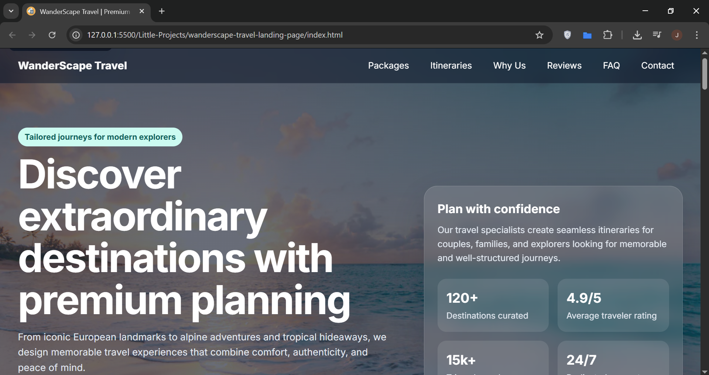

# WanderScape Travel Landing Page

A travel landing page built with semantic HTML, modern CSS, and vanilla JavaScript.

This project was created as an evolution from a basic practice landing page into a more polished frontend project with a stronger focus on:

- semantic structure
- accessibility
- responsive design
- user experience
- maintainable code organization
- portfolio-level presentation

## Screenshot

